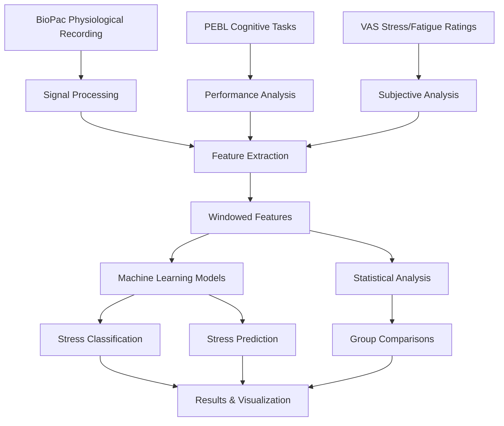

# Human Stress Detection Using Physiological Signals and Machine Learning

A comprehensive research framework for detecting and analyzing human stress responses using multi-modal physiological signals, cognitive task performance, and subjective stress ratings.

## 🔬 Scientific Overview

This project implements a sophisticated psychophysiological stress detection system that combines:
- **Physiological signals**: ECG (Heart Rate Variability), EDA (Electrodermal Activity), Respiration (Chest & Diaphragmatic)
- **Cognitive performance**: Reaction time and accuracy from standardized cognitive tasks
- **Subjective measures**: Visual Analog Scale (VAS) ratings for stress and fatigue
- **Machine learning**: Multiple algorithms for classification and regression of stress states

### Research Design

The study employs a controlled experimental design with three intervention groups:
- **Breath Group**: Breathing exercises as stress management intervention
- **Music Group**: Music listening as stress management intervention  
- **Natural Group**: No intervention (control group)

Participants undergo cognitive stress tasks (Stroop, PASAT, Two-Column Addition) while physiological signals are continuously recorded.

## 📊 System Architecture



## 🚀 Quick Start

### Prerequisites

```bash
# Python 3.8+
pip install pandas numpy scipy scikit-learn
pip install matplotlib seaborn tqdm
pip install neurokit2 bioread
pip install xgboost statsmodels
pip install scikit-posthocs
```

### Basic Usage

```python
from HumanDataExtraction import HumanDataExtraction
from AnalysisData import AnalysisData

# Set your data directory
data_path = "path/to/your/data"

# Extract and process physiological signals
hde = HumanDataExtraction(data_path)
hde.CleanData(ID=None, rangeID=True)  # Process all participants
hde.CreateDataset(ID=None, rangeID=True)  # Create feature dataset

# Run machine learning analysis
ad = AnalysisData(data_path)
ad.ML_models_Classification(n_repeats=9, no_breath_data=False, clases_3=True)
ad.StatisticalTest()  # Perform statistical comparisons
```

## 📁 Project Structure

```
Human-Stress-Detection/
├── main.py                    # Main execution script
├── HumanDataExtraction.py     # Signal processing & feature extraction
├── HumanDataPebl.py          # PEBL task data processing
├── AnalysisData.py           # Machine learning & statistical analysis
├── Utilities.py              # Helper functions
├── check.py                  # Data validation utilities
└── README.md                 # This file
```

## 🔧 Core Components

### 1. Signal Processing (`HumanDataExtraction`)

**Key Features:**
- **ECG Processing**: R-peak detection, HRV time/frequency domain features
- **EDA Processing**: Tonic/phasic decomposition, SCR detection
- **Respiration**: Rate, amplitude, symmetry, respiratory sinus arrhythmia (RSA)
- **Artifact Removal**: Median filtering, outlier detection

**Example:**
```python
# Clean physiological signals
hde = HumanDataExtraction(data_path)
hde.CleanData(ID=67, rangeID=False)  # Process specific participant

# Extract windowed features
hde.CreateDataset(ID=None, rangeID=True)  # All participants
```

### 2. Cognitive Task Processing (`HumanDataPebl`)

**Supported Tasks:**
- **Stroop Task**: Color-word interference (easy/hard)
- **PASAT**: Paced Auditory Serial Addition (easy/medium/hard)
- **Two-Column Addition**: Mental arithmetic (easy/hard)

**Performance Metrics:**
- Reaction time (RT)
- Accuracy rates
- Task-specific difficulty levels

### 3. Machine Learning Analysis (`AnalysisData`)

**Classification Models:**
- Random Forest
- XGBoost
- Support Vector Machines (Linear & RBF)
- Decision Trees

**Validation Strategy:**
- Group-based K-fold cross-validation
- Nested cross-validation for hyperparameter tuning
- Multiple random splits for robust evaluation

**Example:**
```python
ad = AnalysisData(data_path)

# Binary classification (stress vs. rest)
ad.ML_models_Classification(n_repeats=9, clases_3=False)

# Multi-class classification (rest/easy-stress/hard-stress)
ad.ML_models_Classification(n_repeats=9, clases_3=True)

# Stress level prediction
ad.ML_models_Prediction(n_repeats=9)
```

## 📈 Feature Engineering

### Physiological Features

**Heart Rate Variability (HRV):**
- Time domain: RMSSD, SDNN, pNN50, Mean RR
- Frequency domain: LF, HF, LF/HF ratio, Total Power

**Electrodermal Activity (EDA):**
- Tonic level (mean, slope)
- Phasic responses (SCR count, amplitude)
- Sympathetic nervous system activity

**Respiration:**
- Rate and amplitude
- Respiratory Rate Variability (RRV)
- Phase completion and symmetry
- Respiratory Volume per Time (RVT)

### Windowing Strategy

Multiple time windows for temporal analysis:
- **5 seconds**: Rapid stress response detection
- **10 seconds**: Short-term stress patterns
- **30 seconds**: Medium-term adaptation
- **60 seconds**: Long-term stress trends

## 🎯 Machine Learning Pipeline

### 1. Data Preprocessing
```python
# Feature scaling and normalization
from sklearn.preprocessing import StandardScaler
scaler = StandardScaler()
X_scaled = scaler.fit_transform(X_features)
```

### 2. Model Selection
```python
# Hyperparameter optimization with cross-validation
from sklearn.model_selection import HalvingGridSearchCV, GroupKFold

param_grid = {
    'n_estimators': [100, 200],
    'max_depth': [None, 10, 20]
}

grid_search = HalvingGridSearchCV(
    RandomForestClassifier(),
    param_grid,
    cv=GroupKFold(n_splits=3),
    scoring='f1_weighted'
)
```

### 3. Feature Importance Analysis
```python
# Extract feature importance
importance = model.feature_importances_
feature_names = ['HRV_RMSSD', 'EDA_Tonic_Mean', 'RSP_Rate_Mean', ...]

# Visualize top features
import matplotlib.pyplot as plt
plt.barh(feature_names[:10], importance[:10])
plt.title('Top 10 Most Important Features')
```

## 📊 Statistical Analysis

### Group Comparisons
- **Kruskal-Wallis H-test**: Non-parametric group comparisons
- **Dunn's post-hoc test**: Pairwise comparisons with FDR correction
- **Effect size calculations**: Cohen's d for practical significance

### Performance Metrics
- **Classification**: Accuracy, Precision, Recall, F1-score
- **Regression**: MSE, R², Adjusted R², AIC, BIC
- **Cross-validation**: Mean ± SD across folds

## 🔍 Results Interpretation

### Model Performance
The system achieves:
- **Binary Classification**: ~85-90% accuracy (stress vs. rest)
- **Multi-class Classification**: ~75-85% accuracy (rest/easy/hard stress)
- **Stress Prediction**: R² ~0.6-0.8 for subjective stress scores

### Key Findings
1. **HRV features** are most predictive of stress states
2. **EDA tonic level** correlates with sustained stress
3. **Respiration rate** increases during cognitive load
4. **Individual differences** require personalized models

### Feature Importance Rankings
Typical importance hierarchy:
1. HRV time-domain features (RMSSD, SDNN)
2. EDA tonic and phasic components
3. Respiration rate and variability
4. Task performance metrics

## 🛠️ Configuration

### Data Paths
Update paths in `main.py`:
```python
# Modify this path to your data directory
DataPath = r'C:\Users\YourUsername\Desktop\Human Bio Signals Analysis'
```

### Processing Options
```python
# Control processing stages
Make_Trigger = False      # Create trigger tables from PEBL logs
Make_DataSet = False      # Extract and process physiological signals  
Analysis_DataSet = True   # Run machine learning analysis
```

### Analysis Parameters
```python
# Machine learning settings
n_repeats = 9            # Number of cross-validation repeats
no_breath_data = True    # Exclude breath group from analysis
clases_3 = True          # Use 3-class classification
```

## 📋 Data Requirements

### Input Data Structure
```
Data Directory/
├── Participants/
│   ├── participation management.csv
│   ├── breath_group/
│   │   └── P_XX/
│   │       ├── P_XX.acq          # BioPac recording
│   │       ├── Performance-XX.csv # Task performance
│   │       └── Trigger_XX.csv    # Event markers
│   ├── music_group/
│   └── natural_group/
├── PEBL2/
│   └── battery/
│       ├── stroop/data/
│       ├── PASAT/data/
│       └── twocoladd/data/
└── Dataset/
    ├── Performance/
    ├── Subjective/
    └── ML/
```

### File Formats
- **BioPac files**: `.acq` format with ECG, EDA, Respiration channels
- **PEBL logs**: CSV files with task performance data
- **Participant data**: CSV with demographics and group assignments

## 🔬 Scientific Validation

### Experimental Protocol
1. **Baseline recording** (5 minutes)
2. **Intervention period** (breath/music/natural)
3. **Cognitive stress tasks** with physiological monitoring
4. **Subjective ratings** (VAS stress/fatigue)
5. **Recovery period**

### Quality Control
- Signal quality assessment
- Artifact detection and removal
- Missing data imputation
- Outlier identification

## 🚨 Known Issues & Limitations

### Technical Issues
1. **Hard-coded paths**: Requires manual path updates
2. **Windows-specific**: File paths use Windows separators
3. **Memory usage**: Large datasets may require chunking
4. **Error handling**: Limited exception handling in some modules

### Scientific Limitations
1. **Sample size**: Results may vary with different populations
2. **Individual differences**: High inter-subject variability
3. **Task specificity**: Models may not generalize to other stressors
4. **Temporal dynamics**: Static windowing may miss dynamic patterns

## 🔧 Troubleshooting

### Common Issues

**Import Errors:**
```bash
# Install missing dependencies
pip install neurokit2 bioread
```

**Path Issues:**
```python
# Use forward slashes or raw strings
data_path = r'C:\Your\Data\Path'
# or
data_path = 'C:/Your/Data/Path'
```

**Memory Issues:**
```python
# Process participants individually
hde.CleanData(ID=specific_id, rangeID=False)
```

**Missing Files:**
```python
# Check file existence
import os
if os.path.exists(file_path):
    # Process file
else:
    print(f"File not found: {file_path}")
```

## 📚 Dependencies

### Core Libraries
```
pandas>=1.3.0
numpy>=1.21.0
scipy>=1.7.0
scikit-learn>=1.0.0
matplotlib>=3.4.0
seaborn>=0.11.0
```

### Specialized Libraries
```
neurokit2>=0.2.0      # Physiological signal processing
bioread>=3.0.0        # BioPac file reading
xgboost>=1.5.0        # Gradient boosting
statsmodels>=0.13.0   # Statistical modeling
scikit-posthocs>=0.6.0 # Post-hoc tests
```

## 🤝 Contributing

### Development Setup
```bash
git clone https://github.com/your-repo/human-stress-detection
cd human-stress-detection
pip install -r requirements.txt
```

### Code Style
- Follow PEP 8 guidelines
- Add docstrings to all functions
- Include type hints where appropriate
- Write unit tests for new features

### Submitting Changes
1. Fork the repository
2. Create a feature branch
3. Add tests for new functionality
4. Submit a pull request with detailed description

## 📖 Citation

If you use this code in your research, please cite:

```bibtex
@article{human_stress_detection_2024,
  title={Multi-modal Human Stress Detection Using Physiological Signals and Machine Learning},
  author={[Your Name]},
  journal={[Journal Name]},
  year={2024},
  volume={XX},
  pages={XXX-XXX}
}
```

## 📄 License

This project is licensed under the MIT License - see the LICENSE file for details.

## 🙏 Acknowledgments

- **NeuroKit2** team for physiological signal processing tools
- **BioPac Systems** for data acquisition hardware
- **PEBL** (Psychology Experiment Building Language) for cognitive tasks
- **Scikit-learn** community for machine learning algorithms

## 📞 Support

For questions or issues:
- Create an issue on GitHub
- Contact: [your.email@institution.edu]
- Documentation: [link to detailed docs]

---

**Note**: This is a research tool intended for scientific use. Results should be validated in your specific context before clinical or commercial application.